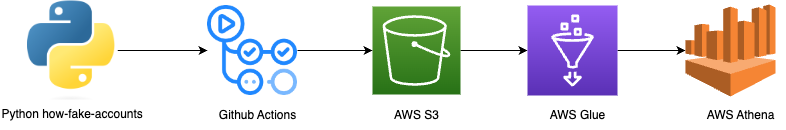
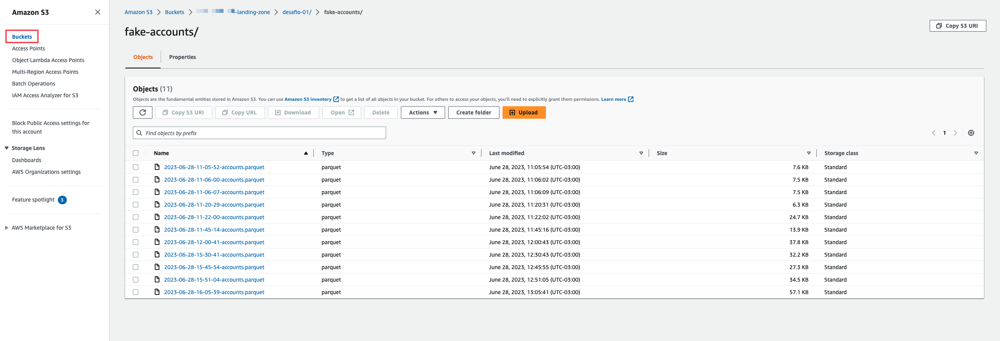
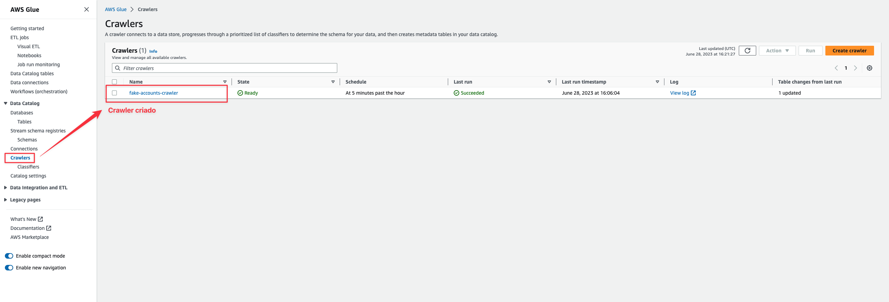
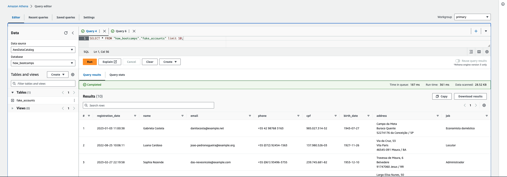
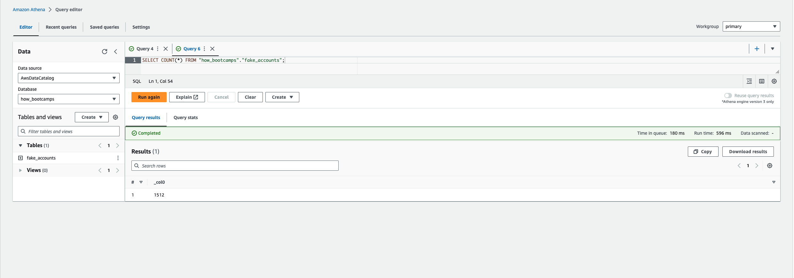
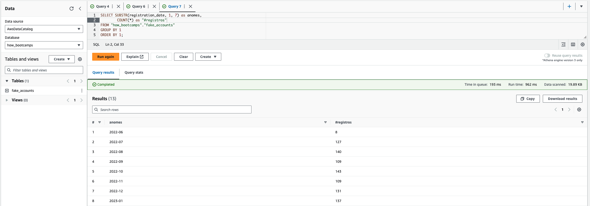

# How Fake Accounts

Esse projeto é a solução para o primeiro desafio do bootcamp da How de engenharia de dados, que consiste na construção de um pipeline de dados com os seguintes passos:

1. Criar uma conta AWS
2. Gerar dados necessários utilizando a biblioteca Faker do Python
3. Armazenar os dados em um Bucket do AWS S3
4. Criar um Crawler dos dados com o AWS Glue
5. Escrever 3 consultas nos dados utilizando o AWS Athena

### Arquitetura da Solução



- O pacote `how-fake-accounts` é utilizado para simular a criação de contas aleatórias
- O código localizado em [pipelines/ingestion_pipeline.py](pipelines/ingestion_pipeline.py) pega os dados de cadastros realizados e faz o upload deles no S3
- O Github Actions é utilizado para schedular um job que consiste em executar o código de ingestão anterior de hora em hora. Isso é feito através do arquivo [.github/workflows/ingestion_pipeline.yaml](.github/workflows/ingestion_pipeline.yaml). **This pipeline takes in the created accounts for the past hour and ingest them into an S3 bucket**. 
- Um Crawler é criado com o AWS Glue para gerar os metados necessários para criar tabelas a partir dos arquivos no bucket
- O Athena é utilizado para fazer as consultas


## Criar uma conta AWS

Nesse caso, basta ir em https://portal.aws.amazon.com/billing/signup e preencher com as informações solicitadas para a criação de uma conta.

## Gerar dados necessários utilizando a biblioteca Faker do Python

Utilizando a funcionalidade de customização de providers da biblioteca [Faker](https://faker.readthedocs.io/en/master/#how-to-create-a-provider), criei um pacote python chamado `how-fake-accounts` que gera uma tabela com contas brasileiras fakes. O pacote está localizado nesse repositório na pasta `how_fake_accounts` e pode ser instalado via `pip install how-fake-accounts`. A funcionalidade principal do pacote está no arquivo `how_fake_accounts/core.py`.

As contas feitas simulam o cadastro de usuários em um site e contém as seguintes informações para cada usuário cadastrado:

- nome
- email
- número de telefone
- cpf
- data de nascimento
- endereço
- emprego

## Armazenar os dados em um bucket do AWS S3

Criei um bucket no AWS S3 que chamei de `${AWS::AccountId}-landing-zone` e uma pasta dentro do bucket `desafio-01/fake-accounts/`. O nome da pasta mais o nome do arquivo que será jogado no S3 compõe a key.

Escrevi um script python localizado em `pipelines/ingestion_pipeline.py` que gera contas de cadastros aleatórias com a bibioteca `how-fake-accounts` e faz o upload para o AWS S3 com o `awswrangler` em formato parquet.

Esse mesmo script é executada de hora em hora em um workflow do Github Actions, simulando assim a ingestão de dados novos no AWS S3. O contexto simulado aqui é a ingestão de novas contas criadas em um site na última hora.



## Criar um Crawler dos dados com o AWS Glue

Criei um Crawler apontando para a pasta onde os arquivos estão no S3 e schedulei para o mesmo rodar a cada hora no minuto 10. Como o pipeline de ingestão do Github Actions executada sempre no minuto 0 e dura menos de 1 minutos, assim garanto que sempre que o Crawler rodar, irá encontrar novos arquivos.



## Escrever 3 consultas nos dados utilizando o AWS Athena

Com a tabela criada, foi possível realizar queries com o Athena.

Segue abaixo alguns screenshots e consultas realizadas





# Próximos Passos
- [ ] Mover os dados da camada landing-zone para uma camada bronze, onde os dados de cpf estariam criptografados.
- [ ] Escrever todos os serviços em Cloud Formation [cf_project_aws_resources.yaml](cf_project_aws_resources.yaml)
    - [x] AWS S3 (criação do bucket)
    - [ ] AWS Glue (crawler)

  
# Sobre o Pacote

## How to install

```bash
pip install how-fake-accounts
```

## How to use

We have mainly two ways to use the package:
- as a package itself, to be imported in python scripts
- as a command line interface

### Package Interface

```python
import os
from datetime import datetime
from how_fake_accounts import fake

# generate 10 random accounts
accounts = fake.generate_accounts(10)
accounts.head()
```

### CLI Interface

To generate 50 accounts, just type into terminal:

```bash
how_fake --n-accounts 50
```
or
```bash
python -m how_fake --n-accounts 50
```

for help, just type:

```bash
how_fake --help
```
